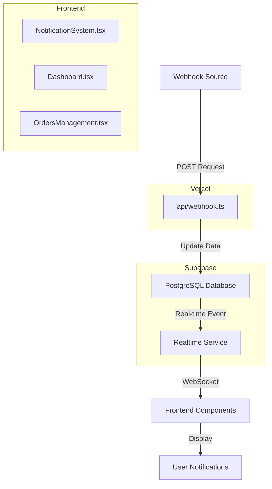
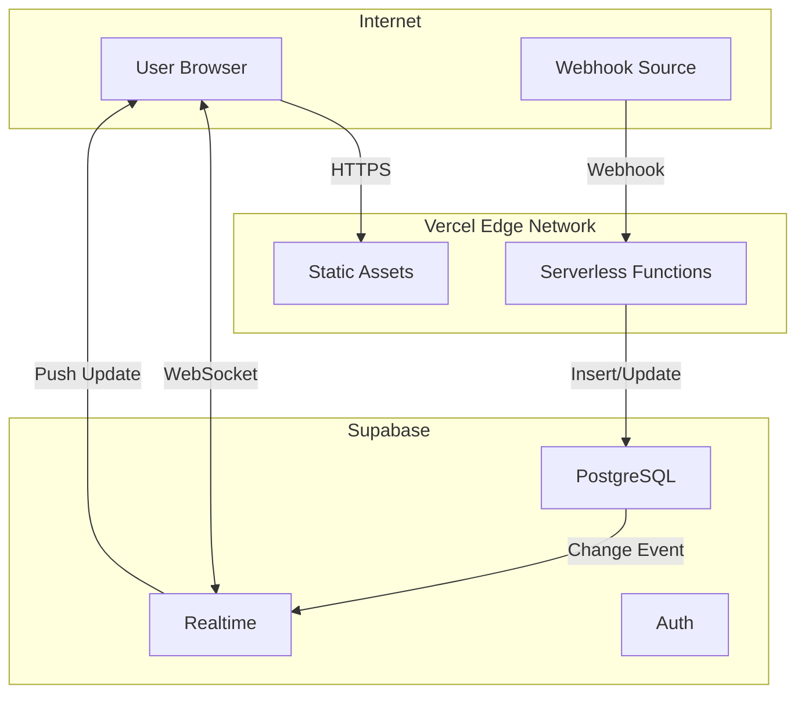
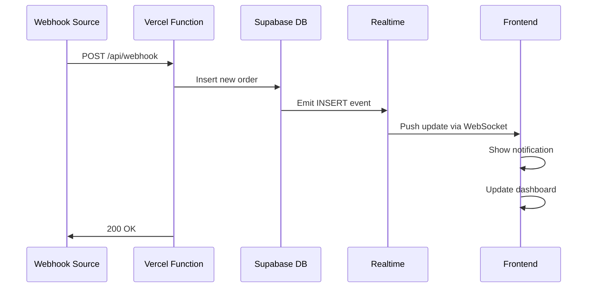
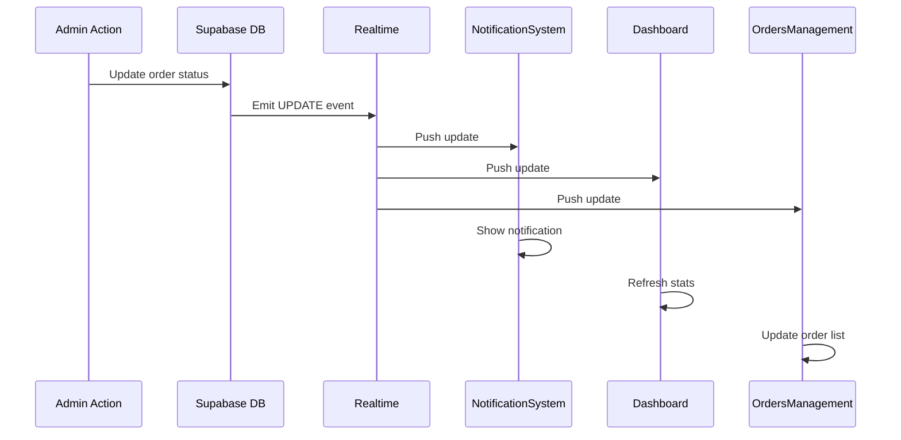

# 🏗️ Application Architecture

## Real-time Data Flow (Vercel + Supabase)



## Component Relationships

```mermaid
graph LR
    A[App.tsx] --> B[Dashboard]
    A --> C[CustomerList]
    A --> D[OrdersManagement]
    A --> E[NotificationSystem]
    
    B -.Supabase Realtime.-> F[(Supabase)]
    C -.Supabase Realtime.-> F
    D -.Supabase Realtime.-> F
    E -.Supabase Realtime.-> F
    
    G[Webhook] -->|HTTP POST| H[/api/webhook]
    H --> F
```

## Deployment Architecture



## Data Flow Sequence

### 1. New Order Webhook Flow



### 2. Order Status Update Flow



## Technology Stack

| Layer | Technology | Purpose |
|-------|-----------|---------|
| **Frontend** | React + TypeScript | UI Components |
| **Build Tool** | Vite | Fast development & bundling |
| **Styling** | Tailwind CSS | Utility-first styling |
| **Hosting** | Vercel | Serverless deployment |
| **Backend** | Vercel Serverless Functions | Webhook handling |
| **Database** | Supabase (PostgreSQL) | Data storage |
| **Real-time** | Supabase Realtime | Live updates |
| **Notifications** | React Toastify | Toast notifications |

## Key Features

### Real-time Subscriptions

**NotificationSystem.tsx:**
- Listens for: `INSERT` and `UPDATE` events on `orders` table
- Shows toast notifications for new orders, deliveries, and payments

**Dashboard.tsx:**
- Listens for: All events (`*`) on `orders` table
- Refreshes stats automatically

**OrdersManagement.tsx:**
- Listens for: All events (`*`) on `orders` table
- Updates order list in real-time

### Webhook Handler

**api/webhook.ts:**
- Accepts POST requests
- Processes webhook data
- Updates Supabase database
- Returns success/error responses
- Optional: Logs to `webhook_logs` table

## Environment Variables

```
VITE_SUPABASE_URL        → Frontend & API
VITE_SUPABASE_ANON_KEY   → Frontend & API
```

## Security Considerations

1. **Supabase RLS (Row Level Security)**
   - Ensure proper policies are set
   - Anonymous users should have read access to necessary tables

2. **Webhook Authentication**
   - Consider adding webhook signature verification
   - Add API key validation if needed

3. **Environment Variables**
   - Never commit `.env` to Git
   - Use Vercel's environment variable system
   - Rotate keys periodically

## Performance Optimizations

1. **Vercel CDN**
   - Static assets served from edge locations
   - Automatic caching

2. **Supabase Connection Pooling**
   - Efficient database connections
   - Auto-scaling

3. **Real-time Subscriptions**
   - Only subscribe to necessary events
   - Cleanup subscriptions on unmount

## Scalability

- ✅ Serverless functions scale automatically
- ✅ Supabase handles connection pooling
- ✅ Vercel CDN distributes load globally
- ✅ No server management required

## Monitoring

**Vercel Dashboard:**
- Function execution logs
- Build logs
- Performance metrics

**Supabase Dashboard:**
- Database queries
- Real-time connections
- API usage

**Browser Console:**
- Real-time events
- Error messages
- Network requests
